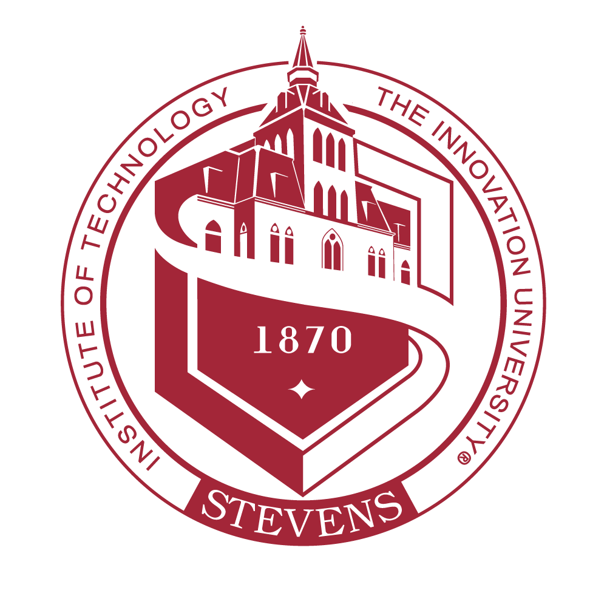

Khayyam Saleem
============

Education
---------

Sep 2015 - May 2019
:   **B.S. Computer Science** -- Stevens Institute of Technology , _Hoboken, NJ_

    _Minors_: Mathematics, Literature

Experience
----------

Apr 2021 - Present
:   **Senior API Architecture Engineer**, J.P. Morgan Chase, *Jersey City, NJ*

    - Created [Developer Portal](https://developer.chase.com) for external partners using Chase APIs
    - Lead team of 7 engineers to deliver API publishing automation and observability with Datadog
    - Provisioned AWS EKS  infrastructure with `terraform` 
    - Built out CI pipeline with Jenkins  and `kustomize`
    - Deployed [automated service virtualization](https://apidemo.chase.com) from OpenAPI spec
    - Strangled out routes from legacy developer portal using reverse-proxy route overrides
    - Created cross-team documentation-as-code system and deployment pipelines using Hugo

Jan 2020 - Apr 2021
:   **Cloud ETL Platform Engineer**, J.P. Morgan Chase, *Jersey City, NJ*

    - Designed and deployed a managed data pipeline solution for ETL jobs on internal k8s 
    - Migrated large-scale ETL jobs from legacy infrastructure to cloud pipelines
    - Developed object inventory and audit API for ETL pipeline artifacts

Jun 2018 - May 2019
:   **Software Engineer Intern**, J.P. Morgan & Chase, *Jersey City, NJ*

    - Developed healthcheck tool for message queue infrastructure

Dec 2018 - Present
:   **Curriculum Developer**, Codecademy  , *Manhattan, NY*

    * Write content for high-volume courses
      * java + spring boot, python, node.js + express, python + flask, go, c# + asp.net, devops, more
    * Audit curriculum content across all courses
    * Built internal ledger and review system for content changes [go, react, web-extensions]

Personal Projects
--------------------

[Life Skills Software](https://lifeskills.software/)
:   A platform for special-needs classrooms, gamifying the assessment and development of life skills

    * Deployed microservice architecture on DigitalOcean  VPS with `terraform`
    * Deployed high-availability sites with Cloudflare 
    * Migrated from VPS to K8S with zero downtime
    * Created CI/CD pipeline for team of 22 to develop and deploy games, videos, articles, and software quickly [Jenkins, github-actions, gitlab-ci]

[gradual-typing](https://github.com/khayyamsaleem/gradual-typing) [type-inference](https://github.com/khayyamsaleem/explicit-lang-type-inference-engine) [aws-k3s-lightsail](https://github.com/khayyamsaleem/aws-k3s-lightsail)
:   Implementation of gradual typing in MIT-scheme Implementation of Hindley-Milner type inference engine in OCaml for Type Systems course Deploy k3s on lightsail with terraform

Skills
----------------------------------------

Languages
:   go, java, rust, ruby, javascript, lua, python, c++, sql, racket, english, urdu, hindi

Frameworks
:  react+redux, node.js+express, python+flask, java+spring-boot, ORMs, LaTeX

Tools
:  docker, nginx, contour, envoy, k8s, hugo, vim and other linux stuff

----

> <hello@khayyam.me> • [Github](https://github.com/khayyamsaleem) • [LinkedIn](https://linkedin.com/in/khayyamsaleem) • +1 (973) 941-7323 • Union City, NJ 07087, USA
